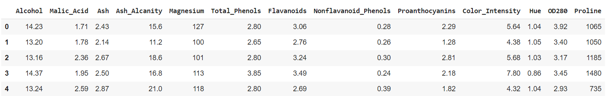
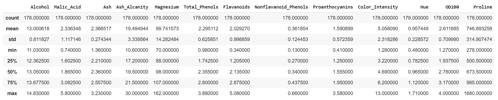
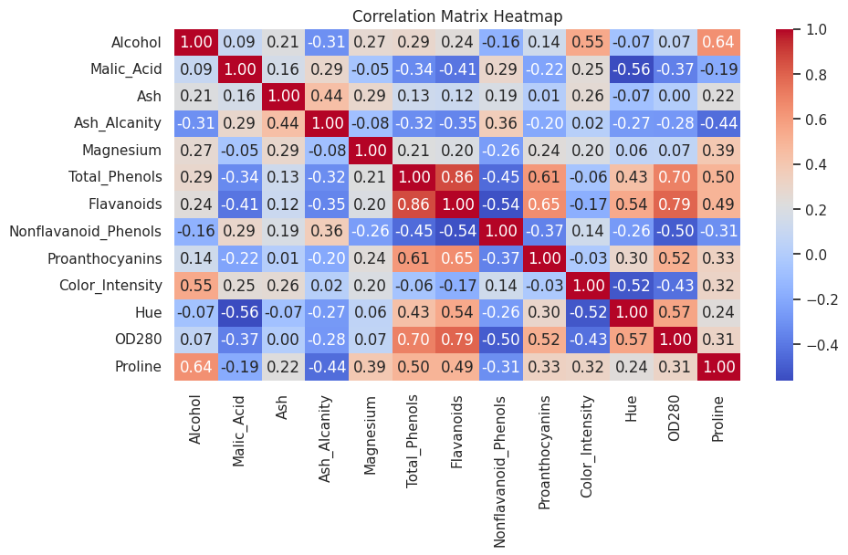
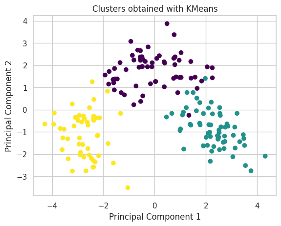
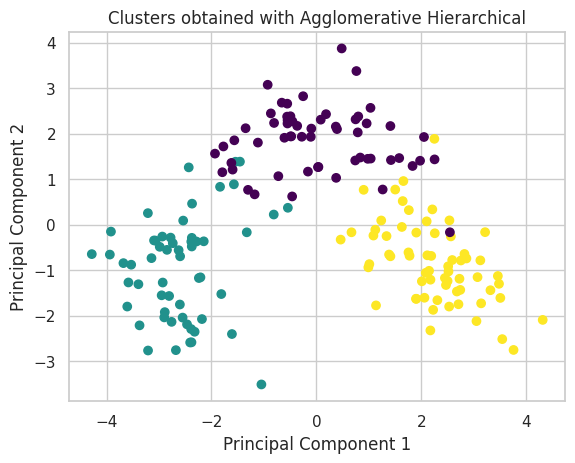
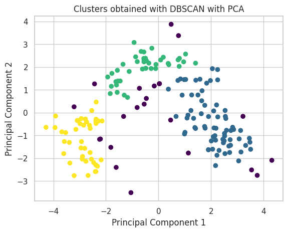
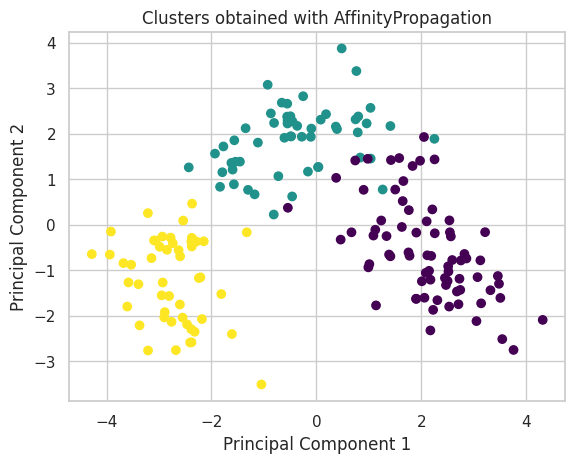
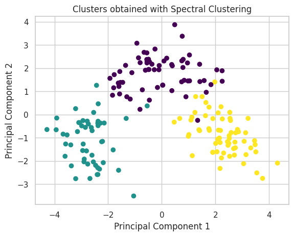
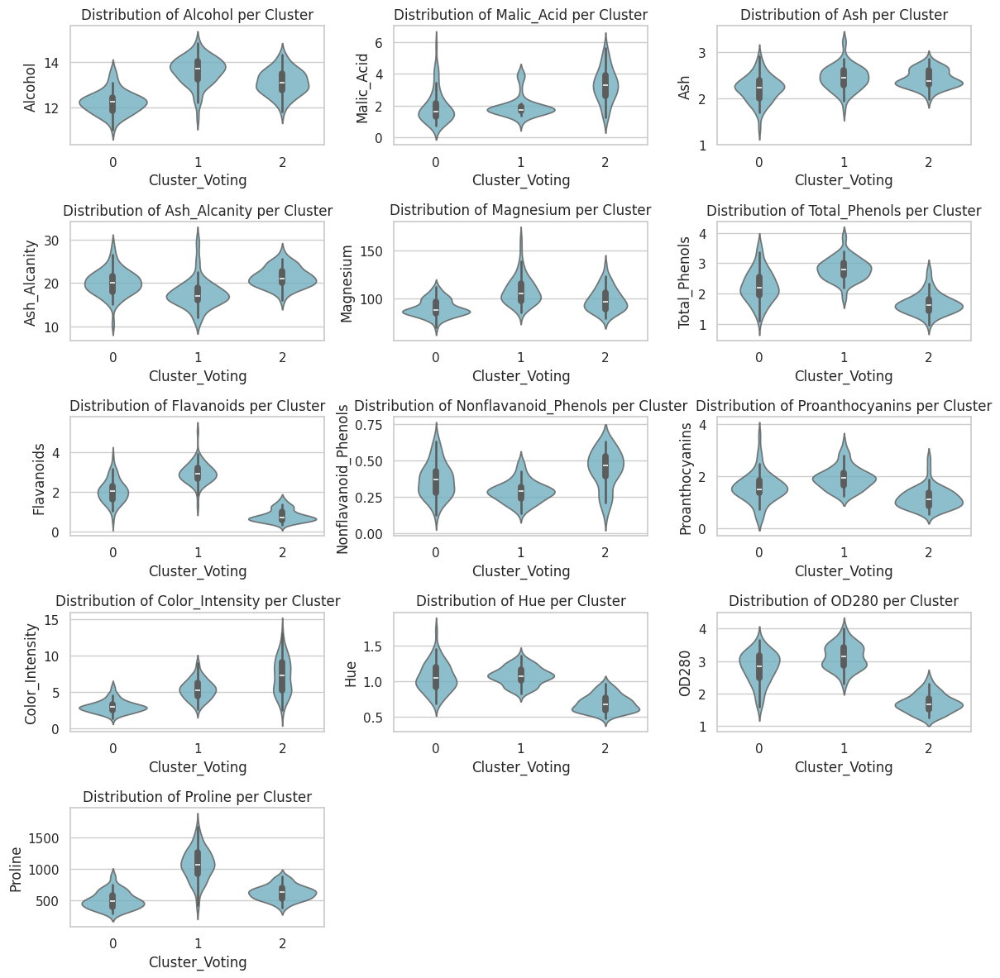

# Data Science Challenge: Uncovering the Hidden Profiles in Wine Data

## Previous information

### Dataset

These data are the results of a chemical analysis of wines grown in the same region in Italy but derived from three different cultivars. The analysis determined the quantities of 13 constituents found in each of the three types of wines.

### Objetive

Explore the provided wine dataset to uncover interesting patterns, profiles, or correlations among the different chemical constituents of the wines. The challenge is open-ended, encouraging creative and exploratory analysis.

### Dicctionary of features

**Alcohol**: The alcohol content in wine, expressed as a percentage of alcohol by volume. It is a key factor that affects the taste and structure of the wine.

**Malic acid**: Malic acid is an organic acid present in grapes and, therefore, in the must before fermentation. It can affect the acidity and flavor of the wine.

**Ash**: The total amount of minerals in the wine after incineration. This value can provide information about the wine's minerality.

**Alcalinity of ash**: The alkalinity of ash is the measure of a substance's capacity to neutralize acidity. In the context of wine, this can influence the perception of acid-base balance.

**Magnesium**: The amount of magnesium present in the wine. Magnesium can affect fermentation and may have implications for the texture and flavor of the wine.

**Total phenols**: The total concentration of phenolic compounds in the wine. Phenols contribute to the structure, color, and flavor of the wine.

**Flavanoids**: Flavonoids are a type of phenol and contribute to the color and complexity of the wine. They may also have health benefits.

**Nonflavanoid phenols**: Another group of phenolic compounds that are not flavonoids. They can also contribute to the structure and flavor of the wine.

**Proanthocyanins**: Phenolic compounds belonging to the tannin family. They contribute to the astringency and mouthfeel of the wine.

**Color intensity**: The intensity of the wine's color, which may be related to the concentration of pigments and phenols.

**Hue**: The tone of the wine's color, measured in degrees. It can provide information about color variation.

**OD280/OD315 of diluted wines**: The ratio of optical absorbances at specific wavelengths. It can be indicative of the concentration of phenolic compounds and other factors in the wine.

**Proline**: An amino acid found in grapes that can influence the stability and flavor of the wine. The amount of proline in the wine may be related to the quality of the grape.

## Data Exploration

Figure 1. First 5 examples of dataset.

Figure 2. Statistical summary of dataset.

Figure 3. Correlation matrix of dataset.

Figure 4. Distribution of dataset's features.

The dataset's values have to be scaled for the clustering process. The standard scale was chosen. PCA was also used to be able to graph in 2 dimensions

## Clustering Exploration

### K-Means

### Agglomerative Hierarchical Clustering

### DBSCAN

### AffinityPropagation

### Spectral Clustering

### Voting Classifier (Ensemble)

